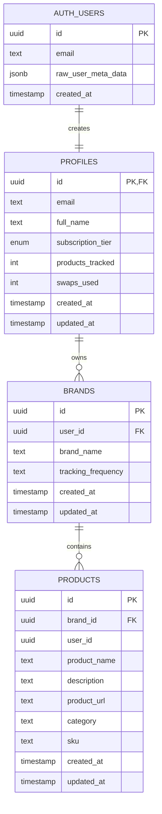

# System Design & UI Manifest

> **Version:** 1.0  
> **Generated:** December 24, 2024  
> **Project:** Visibl - AI Visibility Dashboard

---

## Table of Contents

1. [Page Inventory](#1-page-inventory)
2. [Implicit Data Schema](#2-implicit-data-schema)
3. [User Flow Logic](#3-user-flow-logic)
4. [Component Hierarchy](#4-component-hierarchy)
5. [Example Content Payloads](#5-example-content-payloads)

---

## 1. Page Inventory

### Route Map

| Route | Component | Protected | Description |
|-------|-----------|-----------|-------------|
| `/auth` | `Auth.tsx` | No | Authentication (login/signup) |
| `/` | `Index.tsx` | Yes | Main dashboard with all sections |
| `/product/:productId` | `ProductDetail.tsx` | Yes | Individual product AI visibility detail |
| `/settings` | `Settings.tsx` | Yes | User settings and preferences |
| `/reports` | `Reports.tsx` | Yes | Report configuration and PDF export |
| `*` | `NotFound.tsx` | No | 404 fallback |

---

### 1.1 Auth Page (`/auth`)

**Purpose:** User authentication (sign in / sign up)

**Stateful Elements:**

| Element | State Variable | Data Source | Operations |
|---------|---------------|-------------|------------|
| Login Form | `loginData: { email, password }` | Local state | Calls `supabase.auth.signInWithPassword()` |
| Signup Form | `signupData: { email, password, fullName }` | Local state | Calls `supabase.auth.signUp()` |
| Loading State | `loading: boolean` | Local state | Displays spinner during auth |
| Form Toggle | `isSignUp: boolean` | Local state | Switches between login/signup views |
| Password Visibility | `showPassword: boolean` | Local state | Toggles password field type |

**Database Interactions:**
- **Sign Up:** Creates user in `auth.users`, triggers `handle_new_user()` function to create `profiles` row
- **Sign In:** Authenticates against `auth.users` table

---

### 1.2 Dashboard Page (`/`)

**Purpose:** Main application hub displaying AI visibility metrics, brand management, and actions

**Stateful Elements:**

| Element | State Variable | Data Source | Operations |
|---------|---------------|-------------|------------|
| Brand Selector | `selectedBrandId: string` | Local state (mock) | Switches active brand context |
| Tracked Brands | `trackedBrands: BrandData[]` | Local state (mock) | CRUD on brand list |
| Active Tab | `activeTab: string` | Local state | Navigation between sections |
| Date Range Filter | `selectedDateRange: string` | Local state | Filters dashboard data |
| Model Filter | `selectedModels: string[]` | Local state | Filters by AI platform |
| Sidebar State | `sidebarCollapsed: boolean` | Local state | Collapse/expand navigation |
| User Role | `userRole: 'business_user' \| 'agency_admin'` | Local state | Role-based UI rendering |
| Dashboard States | `dashboardStates: object` | Local state | Loading, error, empty states |
| Add Brand Dialog | `showAddBrandDialog: boolean` | Local state | Modal visibility |
| New Brand Data | `newBrandData: object` | Local state | Form state for adding brands |
| Visible Sections | `visibleSections: string[]` | Local state | Section visibility toggles |
| Recommendations SubTab | `recommendationsSubTab` | Local state | Sub-navigation state |

**Dashboard Sections:**

1. **Overview Section** - AI visibility score, platform coverage, trends
2. **Brand & Products Visibility** - Brand analysis and product listing
3. **Prompt Blast Lab** - Query management with generate/monitor/test tabs
4. **Actions Lab** - Recommendations with on-site/authority/actions log/content studio tabs

**Database Interactions (Future):**
- Should fetch brands from `brands` table: `SELECT * FROM brands WHERE user_id = auth.uid()`
- Should fetch products from `products` table: `SELECT * FROM products WHERE brand_id = ?`

---

### 1.3 Product Detail Page (`/product/:productId`)

**Purpose:** Detailed AI visibility analysis for a specific product

**Stateful Elements:**

| Element | State Variable | Data Source | Operations |
|---------|---------------|-------------|------------|
| Active Section | `activeSection: string` | Local state | Tab navigation (prompts/opportunities) |
| Product Data | `mockProduct: object` | Local state (mock) | Product details |
| Prompts List | `prompts: Prompt[]` | Local state (mock) | CRUD on prompt list |
| Selected Prompts | `selectedPrompts: number[]` | Local state | Bulk selection for actions |
| Pin Status | `isPinned: boolean` | Local state | Watchlist toggle |
| Analysis Progress | `analysisProgress: number` | Local state | Re-analysis progress bar |
| Fidelity Sheet | `showFidelitySheet: boolean` | Local state | Detail sheet visibility |
| Add Prompt Dialog | `showAddPrompt: boolean` | Local state | Modal visibility |

**Key Features:**
- Platform coverage pillar view (ChatGPT, Gemini, Perplexity, Grok)
- Prompt/query management with queue functionality
- Gap analysis for optimization opportunities
- Keyword tracking table

**Database Interactions (Future):**
- Should fetch product from `products` table: `SELECT * FROM products WHERE id = :productId AND user_id = auth.uid()`

---

### 1.4 Settings Page (`/settings`)

**Purpose:** User preferences and account management

**Stateful Elements:**

| Element | State Variable | Data Source | Operations |
|---------|---------------|-------------|------------|
| Active Tab | `activeTab: SettingsTab` | Local state | Section navigation |

**Settings Sections:**

| Tab Key | Component | Purpose |
|---------|-----------|---------|
| `profile` | `ProfileSettings` | Name, email, avatar |
| `account` | `AccountSettingsPanel` | Account-level settings |
| `password` | `PasswordSettings` | Password & 2FA |
| `invite` | `InviteSettings` | Team invitations |
| `people` | `PeopleSettings` | Workspace members |
| `appearance` | `AppearanceSettings` | UI preferences |
| `theme` | `ThemeSettings` | Theme selection |
| `color-scheme` | `ColorSchemeSettings` | Color customization |
| `billing` | `BillingSettingsPanel` | Subscription & payments |

**Database Interactions:**
- Updates `profiles` table: `UPDATE profiles SET ... WHERE id = auth.uid()`

---

### 1.5 Reports Page (`/reports`)

**Purpose:** Configure and export PDF reports

**Stateful Elements:**

| Element | State Variable | Data Source | Operations |
|---------|---------------|-------------|------------|
| Wizard Step | `step: 'configure' \| 'edit'` | Local state | Two-phase workflow |
| Date Range | `startDate, endDate: Date` | Local state | Report period |
| Sections Config | `sections: Record<string, SectionConfig>` | Local state | Enable/disable report sections |
| Report Title | `reportTitle: string` | Local state | PDF title |
| Custom Logo | `customLogo: string \| null` | Local state | Uploaded logo for PDF |
| Editor Blocks | `editorBlocks: ReportBlock[]` | Local state | Rich content blocks |
| Navigation Path | `currentPath: NavigationPath` | Local state | Breadcrumb navigation |
| Filters | `productFilter, promptFilter` | Local state | Content filtering |

**Report Sections Available:**
- AI Visibility Score
- Total Mentions
- Platform Coverage
- Top Prompts
- Products
- On-site Optimizations
- Actions Log

---

## 2. Implicit Data Schema

### 2.1 Database Tables (Supabase)

```
┌─────────────────────────────────────────────────────────────────┐
│                         auth.users                               │
│  (Managed by Supabase Auth)                                     │
├─────────────────────────────────────────────────────────────────┤
│  id: UUID (PK)                                                  │
│  email: TEXT                                                    │
│  raw_user_meta_data: JSONB { full_name: string }               │
│  created_at: TIMESTAMP                                          │
└─────────────────────────────────────────────────────────────────┘
                              │
                              │ 1:1
                              ▼
┌─────────────────────────────────────────────────────────────────┐
│                          profiles                                │
├─────────────────────────────────────────────────────────────────┤
│  id: UUID (PK, FK → auth.users.id)                             │
│  email: TEXT                                                    │
│  full_name: TEXT                                                │
│  subscription_tier: ENUM('free', 'pro', 'enterprise')          │
│  products_tracked: INTEGER (default: 0)                         │
│  swaps_used: INTEGER (default: 0)                              │
│  created_at: TIMESTAMP                                          │
│  updated_at: TIMESTAMP                                          │
└─────────────────────────────────────────────────────────────────┘
                              │
                              │ 1:N
                              ▼
┌─────────────────────────────────────────────────────────────────┐
│                           brands                                 │
├─────────────────────────────────────────────────────────────────┤
│  id: UUID (PK)                                                  │
│  user_id: UUID (FK, NOT NULL)                                   │
│  brand_name: TEXT (NOT NULL)                                    │
│  tracking_frequency: TEXT (default: 'twice_weekly')            │
│  created_at: TIMESTAMP                                          │
│  updated_at: TIMESTAMP                                          │
└─────────────────────────────────────────────────────────────────┘
                              │
                              │ 1:N
                              ▼
┌─────────────────────────────────────────────────────────────────┐
│                          products                                │
├─────────────────────────────────────────────────────────────────┤
│  id: UUID (PK)                                                  │
│  brand_id: UUID (FK → brands.id, NOT NULL)                     │
│  user_id: UUID (NOT NULL)                                       │
│  product_name: TEXT (NOT NULL)                                  │
│  description: TEXT                                              │
│  product_url: TEXT                                              │
│  category: TEXT                                                 │
│  sku: TEXT                                                      │
│  created_at: TIMESTAMP                                          │
│  updated_at: TIMESTAMP                                          │
└─────────────────────────────────────────────────────────────────┘
```

### 2.2 Frontend Data Objects (TypeScript Interfaces)

#### BrandData (Mock/Future DB)
```typescript
interface BrandData {
  id: string;
  name: string;
  logo: string;                    // URL to logo image
  url: string;                     // Brand website
  visibilityScore: number;         // 0-100
  totalMentions: number;
  platformCoverage: number;        // Percentage
  industryRanking: number;
  mentionTrend: 'up' | 'down' | 'stable';
  sentimentScore: number;          // 0-100
  lastUpdated: string;             // ISO date
  platforms: PlatformData[];
  products: ProductSummary[];
  competitors: CompetitorData[];
}

interface PlatformData {
  name: 'ChatGPT' | 'Claude' | 'Gemini' | 'Perplexity' | 'Grok';
  mentions: number;
  sentiment: 'positive' | 'neutral' | 'negative';
  coverage: number;
  trend: 'up' | 'down' | 'stable';
}

interface ProductSummary {
  id: number;
  name: string;
  category: string;
  visibilityScore: number;
  mentions: number;
  sentiment: string;
  lastOptimized: string;
}

interface CompetitorData {
  name: string;
  visibilityScore: number;
  mentions: number;
  trend: 'up' | 'down' | 'stable';
}
```

#### Prompt Data
```typescript
interface Prompt {
  id: number;
  model: string;                   // AI platform name
  query: string;                   // The prompt text
  excerpt: string;                 // AI response excerpt
  sentiment: 'positive' | 'neutral' | 'negative';
  url: string;                     // Source URL
  date: string;                    // Relative time string
  mentions: number;
  queued: boolean;
  status: 'completed' | 'queued';
}
```

#### Recommendation/Action Data
```typescript
interface Recommendation {
  id: string;
  title: string;
  plainTitle: string;
  category: 'on-site' | 'off-site' | 'pr-social';
  subcategory: 'quick-wins' | 'foundations' | 'advanced';
  businessImpact: string;
  effort: 'Low' | 'Medium' | 'High';
  whatToChange: string;
  contextNote?: string;
  whyItMatters: string;
  technicalDetails?: {
    currentTitle?: string;
    currentH1?: string;
    currentUrl?: string;
    currentAltText?: string;
    internalLinks?: string[];
    schema?: string;
  };
  tags: string[];
  aiVisibilityIncrease: number;
  contentStudioTemplate?: string;
  priority?: 'do-first' | 'this-week' | 'later';
  hasDraft?: boolean;
}
```

#### Subscription Context
```typescript
interface SubscriptionContextType {
  tier: 'free' | 'pro' | 'enterprise';
  limits: {
    maxProducts: number;
    maxBrands: number;
    trackingFrequency: 'twice_weekly' | 'daily';
  };
  productsTracked: number;
  brandsTracked: number;
  canAddProduct: boolean;
  canAddBrand: boolean;
  swapsUsed: number;
  swapsRemaining: number;
  canSwap: boolean;
  loading: boolean;
}
```

#### Report Block (Editor)
```typescript
interface ReportBlock {
  id: string;
  type: 'section' | 'stat' | 'quote' | 'text';
  content: {
    sectionType?: string;
    title?: string;
    body?: string;
    statValue?: string;
    statLabel?: string;
    quoteText?: string;
    quoteAuthor?: string;
  };
}
```

### 2.3 Entity Relationship Diagram (Mermaid)



---

## 3. User Flow Logic

### 3.1 Authentication Flow

```
┌─────────────────────────────────────────────────────────────────┐
│                    AUTHENTICATION FLOW                          │
└─────────────────────────────────────────────────────────────────┘

User visits any protected route
        │
        ▼
┌───────────────────┐
│ ProtectedRoute    │
│ checks auth state │
└───────────────────┘
        │
        ├── IF loading → Show "Loading..." spinner
        │
        ├── IF !user → Navigate to /auth
        │
        └── IF user → Render children
        
─────────────────────────────────────────────────────────────────

On /auth page:

┌───────────────────┐
│  User submits     │
│  login form       │
└───────────────────┘
        │
        ▼
┌───────────────────┐
│ Validate with Zod │
│ email & password  │
└───────────────────┘
        │
        ├── IF validation fails → Show toast error
        │
        └── IF passes → Call signIn()
                │
                ├── IF error → Show toast: "Login Failed"
                │
                └── IF success → Navigate to "/"

─────────────────────────────────────────────────────────────────

Sign Up Flow:

┌───────────────────┐
│ User submits      │
│ signup form       │
└───────────────────┘
        │
        ▼
┌───────────────────┐
│ Validate:         │
│ - email (Zod)     │
│ - password (min 6)│
│ - fullName (req)  │
└───────────────────┘
        │
        ├── IF fails → Show toast error
        │
        └── IF passes → Call signUp()
                │
                ├── IF error → Show toast: "Signup Failed"
                │
                └── IF success → 
                    1. Trigger: handle_new_user() creates profile
                    2. Show toast: "Account Created!"
                    3. Navigate to "/"
```

### 3.2 Dashboard Navigation Flow

```
┌─────────────────────────────────────────────────────────────────┐
│                    DASHBOARD NAVIGATION                          │
└─────────────────────────────────────────────────────────────────┘

User lands on / (Dashboard)
        │
        ▼
┌───────────────────────────────────────────────────────────────┐
│ Check URL params: ?tab=X&subtab=Y&productId=Z                 │
│                                                               │
│ IF tab param exists && valid section:                         │
│   → Set activeTab = tab                                       │
│   → IF subtab=on-site → Set recommendationsSubTab             │
│   → IF productId → Set preselectedProductId                   │
│   → Clear URL params (replaceState)                           │
└───────────────────────────────────────────────────────────────┘
        │
        ▼
┌───────────────────┐
│ Render Dashboard  │
│ with activeTab    │
└───────────────────┘

─────────────────────────────────────────────────────────────────

Tab Switching:

User clicks tab (overview | brand | queries | recommendations)
        │
        ▼
┌───────────────────┐
│ setActiveTab(key) │
└───────────────────┘
        │
        ▼
Corresponding section component renders

─────────────────────────────────────────────────────────────────

Product Click:

User clicks product card in Brand section
        │
        ▼
┌───────────────────────────────────────────────────────────────┐
│ Save scroll position: setPreviousScrollPosition(window.scrollY)│
│ Navigate to: /product/{productId}                              │
└───────────────────────────────────────────────────────────────┘

─────────────────────────────────────────────────────────────────

Return to Dashboard:

User clicks back on Product Detail
        │
        ▼
┌───────────────────────────────────────────────────────────────┐
│ IF returning to overview tab && previousScrollPosition > 0:   │
│   → setTimeout(100ms) → window.scrollTo(0, savedPosition)    │
│   → Reset previousScrollPosition to 0                         │
└───────────────────────────────────────────────────────────────┘
```

### 3.3 Brand Management Flow

```
┌─────────────────────────────────────────────────────────────────┐
│                    ADD NEW BRAND FLOW                           │
└─────────────────────────────────────────────────────────────────┘

User clicks "Add Brand" button
        │
        ▼
┌───────────────────┐
│ setShowAddBrand   │
│ Dialog(true)      │
└───────────────────┘
        │
        ▼
┌───────────────────────────────────────────────────────────────┐
│ Step 1: Enter brand details                                   │
│   - Brand Name (required)                                     │
│   - Website URL (required)                                    │
│   - Logo upload (optional)                                    │
│   - Report frequency                                          │
└───────────────────────────────────────────────────────────────┘
        │
        ▼
User clicks "Add Brand"
        │
        ├── IF !name || !url → Return (validation)
        │
        └── IF valid:
            1. Create newBrand object with random initial scores
            2. setTrackedBrands([...prev, newBrand])
            3. setSelectedBrandId(newBrand.id)
            4. Show toast: "Brand Added Successfully"
            5. Close dialog
            6. Reset form state

─────────────────────────────────────────────────────────────────

Switch Active Brand:

User selects brand from dropdown/picker
        │
        ▼
┌───────────────────────────────────────────────────────────────┐
│ setSelectedBrandId(brandId)                                   │
│ → All dashboard components re-render with new selectedBrand   │
└───────────────────────────────────────────────────────────────┘
```

### 3.4 Report Generation Flow

```
┌─────────────────────────────────────────────────────────────────┐
│                    REPORT GENERATION FLOW                       │
└─────────────────────────────────────────────────────────────────┘

User navigates to /reports
        │
        ▼
┌───────────────────────────────────────────────────────────────┐
│ Step 1: CONFIGURE                                             │
│                                                               │
│ - Select date range                                           │
│ - Navigate into sections (AI Visibility, Prompts, Products,   │
│   Optimizations, Actions)                                     │
│ - Toggle individual items on/off                              │
│ - Use filters (ai-ready, needs-improvement)                   │
└───────────────────────────────────────────────────────────────┘
        │
        ▼
User clicks "Proceed to Edit"
        │
        ▼
┌───────────────────────────────────────────────────────────────┐
│ generateBlocks() creates ReportBlock[] from selections        │
│ setEditorBlocks(blocks)                                       │
│ setStep('edit')                                               │
└───────────────────────────────────────────────────────────────┘
        │
        ▼
┌───────────────────────────────────────────────────────────────┐
│ Step 2: EDIT                                                  │
│                                                               │
│ - View live preview (ReportPreview component)                 │
│ - Edit report title                                           │
│ - Upload custom logo                                          │
│ - Toggle page numbers                                         │
│ - Rearrange/edit blocks in ReportEditor                      │
└───────────────────────────────────────────────────────────────┘
        │
        ▼
User clicks "Export PDF"
        │
        ├── IF editorBlocks.length === 0:
        │   → Show toast: "No content to export"
        │   → Return
        │
        └── IF has blocks:
            1. setIsExporting(true)
            2. Call downloadReportPDF({blocks, title, date, logo...})
            3. IF success → toast: "Report exported"
            4. IF error → toast: "Export failed"
            5. setIsExporting(false)
```

### 3.5 Product Analysis Flow

```
┌─────────────────────────────────────────────────────────────────┐
│                    PRODUCT RE-ANALYSIS FLOW                     │
└─────────────────────────────────────────────────────────────────┘

User clicks "Re-analyze" on Product Detail page
        │
        ▼
┌───────────────────────────────────────────────────────────────┐
│ setIsReanalyzing(true)                                        │
│ setAnalysisProgress(0)                                        │
│ Show loading overlay with progress bar                        │
└───────────────────────────────────────────────────────────────┘
        │
        ▼
┌───────────────────────────────────────────────────────────────┐
│ Interval updates progress (random increments)                 │
│ Progress messages:                                            │
│   < 30%: "Scanning product pages..."                         │
│   < 60%: "Analyzing AI mentions..."                          │
│   < 90%: "Updating metrics..."                               │
│   >= 90%: "Finalizing results..."                            │
└───────────────────────────────────────────────────────────────┘
        │
        ▼ (after 4 seconds)
┌───────────────────────────────────────────────────────────────┐
│ setAnalysisProgress(100)                                      │
│ Wait 1 second                                                 │
│ setIsReanalyzing(false)                                       │
│ setAnalysisProgress(0)                                        │
│ Show toast: "Analysis Complete"                               │
└───────────────────────────────────────────────────────────────┘

─────────────────────────────────────────────────────────────────

Prompt Management:

Add Prompt:
  IF prompts.length >= MAX_PROMPTS (5):
    → Toast: "Limit Reached"
    → Return
  ELSE:
    → Create new prompt with status: "queued"
    → Add to prompts array
    → Close dialog
    → Toast: "Prompt Queued"

Delete Prompt:
  → Filter out prompt from array
  → Toast: "Prompt Deleted"

Toggle Queue:
  → Toggle prompt.queued boolean
  → Update status to "queued" or "completed"
  → Toast: "Added to Queue" or "Removed from Queue"
```

---

## 4. Component Hierarchy

### 4.1 Application Structure

```
App.tsx
├── QueryClientProvider
├── TooltipProvider
├── Toaster (shadcn)
├── Sonner (toast notifications)
└── BrowserRouter
    └── AuthProvider (Context)
        └── SubscriptionProvider (Context)
            └── Routes
                ├── /auth → Auth.tsx
                ├── / → ProtectedRoute → Index.tsx
                ├── /product/:productId → ProtectedRoute → ProductDetail.tsx
                ├── /settings → ProtectedRoute → Settings.tsx
                ├── /reports → ProtectedRoute → Reports.tsx
                └── * → NotFound.tsx
```

### 4.2 Reusable UI Components (`src/components/ui/`)

| Component | Purpose | Key Props |
|-----------|---------|-----------|
| `Button` | Primary action element | `variant`, `size`, `disabled` |
| `Card` | Container with border/shadow | `className` |
| `Dialog` | Modal overlay | `open`, `onOpenChange` |
| `Input` | Form text input | `type`, `placeholder`, `value`, `onChange` |
| `Select` | Dropdown selection | `value`, `onValueChange` |
| `Badge` | Status/label indicator | `variant` |
| `Toast/Toaster` | Notification system | Via `useToast()` hook |
| `Tabs` | Tab navigation | `value`, `onValueChange` |
| `Table` | Data tables | Composed from `TableHeader`, `TableBody`, etc. |
| `Sheet` | Slide-out panel | `open`, `onOpenChange` |
| `Popover` | Floating content | `open`, trigger element |
| `Tooltip` | Hover hints | `content` |
| `Progress` | Progress bar | `value` (0-100) |
| `Separator` | Visual divider | `orientation` |
| `Checkbox` | Toggle input | `checked`, `onCheckedChange` |
| `Switch` | On/off toggle | `checked`, `onCheckedChange` |
| `Calendar` | Date picker | `selected`, `onSelect` |
| `Breadcrumb` | Navigation trail | Composed components |
| `ScrollArea` | Custom scrollbar | `className` |
| `Skeleton` | Loading placeholder | `className` |

### 4.3 Feature Components

#### Dashboard Components (`src/components/dashboard/`)

| Component | Purpose |
|-----------|---------|
| `OverviewSection` | AI visibility score cards, platform coverage |
| `BrandAnalysisSection` | Brand metrics and comparison |
| `BrandManagementSection` | Brand CRUD operations |
| `CompetitorSection` | Competitor comparison data |
| `TrendsSection` | Historical trend charts |
| `RecommendationsSection` | Action recommendations |
| `QueriesAndPromptsSection` | Prompt management UI |
| `TechnicalCrawlabilitySection` | Technical SEO data |
| `ExternalAIVisibilitySection` | External AI mentions |
| `AgencyAdminSection` | Agency-specific management |

#### Actions Lab Components (`src/components/actions-lab/`)

| Component | Purpose |
|-----------|---------|
| `ActionsLab` | Main actions container |
| `ActionCard` | Individual action item |
| `ActionGroup` | Grouped actions by category |
| `FilterBar` | Filter controls |
| `ContentQueueBar` | Content generation queue |
| `ContentGenerationWorkflow` | Content creation wizard |
| `ContentStudioLibrary` | Content template library |
| `AEOContentStudio` | AI-enhanced optimization studio |
| `OptimizedStructurePanel` | SEO structure editor |
| `SerpPreviewPanel` | Search result preview |
| `EditableHeadersPanel` | Header structure editor |
| `ContextNotesPanel` | Contextual notes |
| `WorkflowModeSelector` | Workflow mode toggle |
| `ProductSourceSelector` | Product selection |
| `PromptSourceSelector` | Prompt selection |
| `ContentTypeSelector` | Content type picker |
| `StrategyOverview` | Strategy summary view |
| `ContextualTransitionModal` | Transition overlay |
| `ReviewHandoffPanel` | Review handoff UI |

#### Settings Components (`src/components/settings/`)

| Component | Purpose |
|-----------|---------|
| `ProfileSettings` | User profile form |
| `AccountSettingsPanel` | Account preferences |
| `PasswordSettings` | Password change form |
| `InviteSettings` | Team invitation |
| `PeopleSettings` | Team member management |
| `AppearanceSettings` | UI preferences |
| `ThemeSettings` | Theme selection |
| `ColorSchemeSettings` | Color customization |
| `BillingSettingsPanel` | Subscription management |

#### Reports Components (`src/components/reports/`)

| Component | Purpose |
|-----------|---------|
| `ReportEditor` | Block-based report editor |
| `ReportPreview` | Live PDF preview |

### 4.4 Context Providers

| Context | Purpose | Key Values |
|---------|---------|------------|
| `AuthContext` | Authentication state | `user`, `session`, `signIn`, `signUp`, `signOut` |
| `SubscriptionContext` | Subscription limits | `tier`, `limits`, `canAddProduct`, `canAddBrand` |

### 4.5 Custom Hooks

| Hook | Purpose | Returns |
|------|---------|---------|
| `useAuth` | Access auth context | `AuthContextType` |
| `useSubscription` | Access subscription context | `SubscriptionContextType` |
| `useToast` | Toast notifications | `toast()` function |
| `useMobile` | Responsive breakpoint | `boolean` |

---

## 5. Example Content Payloads

### 5.1 Brand Data Payload

```json
{
  "id": "nike",
  "name": "Nike",
  "logo": "/lovable-uploads/d296743b-ff18-4da8-8546-d789de582706.png",
  "url": "nike.com",
  "visibilityScore": 87,
  "totalMentions": 12847,
  "platformCoverage": 89,
  "industryRanking": 2,
  "mentionTrend": "up",
  "sentimentScore": 78,
  "lastUpdated": "2024-01-15",
  "platforms": [
    {
      "name": "ChatGPT",
      "mentions": 4234,
      "sentiment": "positive",
      "coverage": 92,
      "trend": "up"
    },
    {
      "name": "Claude",
      "mentions": 3456,
      "sentiment": "positive",
      "coverage": 87,
      "trend": "up"
    },
    {
      "name": "Gemini",
      "mentions": 2847,
      "sentiment": "neutral",
      "coverage": 84,
      "trend": "stable"
    },
    {
      "name": "Perplexity",
      "mentions": 2310,
      "sentiment": "positive",
      "coverage": 91,
      "trend": "up"
    }
  ],
  "products": [
    {
      "id": 1,
      "name": "Air Max",
      "category": "Footwear",
      "visibilityScore": 92,
      "mentions": 3421,
      "sentiment": "positive",
      "lastOptimized": "2024-01-12"
    },
    {
      "id": 2,
      "name": "Air Jordan",
      "category": "Footwear",
      "visibilityScore": 94,
      "mentions": 4123,
      "sentiment": "positive",
      "lastOptimized": "2024-01-10"
    }
  ],
  "competitors": [
    {
      "name": "Adidas",
      "visibilityScore": 84,
      "mentions": 11234,
      "trend": "up"
    },
    {
      "name": "Puma",
      "visibilityScore": 72,
      "mentions": 8456,
      "trend": "down"
    }
  ]
}
```

### 5.2 Product Detail Payload

```json
{
  "id": "air-max-1",
  "name": "Nike Air Max 1",
  "sku": "AIR-MAX-001",
  "score": 82,
  "trend": 2,
  "category": "Footwear",
  "image": "/placeholder-product.jpg",
  "lastAnalyzed": "2 hours ago",
  "mentions": 847,
  "avgRank": 3,
  "pagesCrawled": 12,
  "pillars": {
    "platformCoverage": {
      "current": 2,
      "total": 4,
      "platforms": ["ChatGPT", "Gemini", "Perplexity", "Grok"],
      "platformDetails": {
        "ChatGPT": {
          "name": "ChatGPT",
          "active": true,
          "benefit": "Largest user base with 100M+ weekly active users."
        },
        "Gemini": {
          "name": "Gemini",
          "active": true,
          "benefit": "Integrated with Google Search."
        },
        "Perplexity": {
          "name": "Perplexity",
          "active": false,
          "benefit": "Research-focused AI with citation support."
        },
        "Grok": {
          "name": "Grok",
          "active": false,
          "benefit": "Real-time X/Twitter integration."
        }
      }
    },
    "intelligenceDepth": {
      "current": 12,
      "total": 25
    },
    "marketPresence": {
      "mentions": 1247,
      "trend": [45, 52, 48, 61, 55, 72, 68]
    },
    "contentFreshness": {
      "activePages": 8,
      "lastSync": "2m ago"
    }
  }
}
```

### 5.3 Prompts List Payload

```json
[
  {
    "id": 1,
    "model": "ChatGPT",
    "query": "best running shoes 2024",
    "excerpt": "Nike Air Max 1 offers excellent cushioning for daily runs with its Air Max technology providing superior comfort and impact protection.",
    "sentiment": "positive",
    "url": "nike.com/air-max-1",
    "date": "2 hours ago",
    "mentions": 3,
    "queued": false,
    "status": "completed"
  },
  {
    "id": 2,
    "model": "Gemini",
    "query": "comfortable athletic footwear",
    "excerpt": "The Nike Air Max 1 combines classic design with reliable cushioning technology.",
    "sentiment": "positive",
    "url": "nike.com/air-max-1",
    "date": "4 hours ago",
    "mentions": 2,
    "queued": false,
    "status": "completed"
  }
]
```

### 5.4 Recommendations Payload

```json
[
  {
    "id": "rec-001",
    "title": "Optimize product page title tag",
    "plainTitle": "Optimize product page title tag",
    "category": "on-site",
    "subcategory": "quick-wins",
    "businessImpact": "Increase click-through rate by 15-20%",
    "effort": "Low",
    "whatToChange": "Update title to include primary keyword and brand name",
    "whyItMatters": "AI systems heavily weight title tags for relevance signals",
    "technicalDetails": {
      "currentTitle": "Nike Air Max 1 | Nike.com",
      "currentH1": "Air Max 1"
    },
    "tags": ["SEO", "Title Tag", "Quick Win"],
    "aiVisibilityIncrease": 12,
    "priority": "do-first"
  },
  {
    "id": "rec-002",
    "title": "Add FAQ schema to product page",
    "plainTitle": "Add FAQ schema",
    "category": "on-site",
    "subcategory": "foundations",
    "businessImpact": "Improve featured snippet eligibility",
    "effort": "Medium",
    "whatToChange": "Implement FAQ structured data markup",
    "whyItMatters": "Helps AI systems extract and cite your content",
    "technicalDetails": {
      "schema": "FAQPage"
    },
    "tags": ["Schema", "Technical SEO"],
    "aiVisibilityIncrease": 8,
    "priority": "this-week"
  }
]
```

### 5.5 User Profile Payload

```json
{
  "id": "uuid-user-123",
  "email": "jane@company.com",
  "full_name": "Jane Smith",
  "subscription_tier": "pro",
  "products_tracked": 15,
  "swaps_used": 1,
  "created_at": "2024-01-01T00:00:00Z",
  "updated_at": "2024-01-15T12:30:00Z"
}
```

### 5.6 Report Configuration Payload

```json
{
  "reportTitle": "AI Visibility Report - Q1 2024",
  "dateRange": {
    "start": "2024-01-01",
    "end": "2024-03-31"
  },
  "showPageNumbers": true,
  "customLogo": "data:image/png;base64,...",
  "brandName": "Nike",
  "sections": {
    "score": { "enabled": true },
    "mentions": { "enabled": true },
    "platformCoverage": {
      "enabled": true,
      "items": ["chatgpt", "gemini", "claude", "perplexity"]
    },
    "prompts": {
      "enabled": true,
      "items": ["1", "2", "3"]
    },
    "products": {
      "enabled": true,
      "items": ["1", "2"]
    },
    "optimizations": {
      "enabled": false,
      "items": []
    },
    "actions": {
      "enabled": true,
      "items": ["1", "2", "3", "4"]
    }
  }
}
```

### 5.7 Actions Log Payload

```json
[
  {
    "id": "1",
    "title": "Optimized product description for Air Max",
    "date": "Dec 18, 2024",
    "type": "Content",
    "status": "live"
  },
  {
    "id": "2",
    "title": "Updated meta tags for running category",
    "date": "Dec 15, 2024",
    "type": "SEO",
    "status": "live"
  },
  {
    "id": "3",
    "title": "Added FAQ schema to landing page",
    "date": "Dec 12, 2024",
    "type": "Technical",
    "status": "draft"
  }
]
```

---

## Appendix: Subscription Tier Limits

| Tier | Max Products | Max Brands | Tracking Frequency | Swaps |
|------|--------------|------------|-------------------|-------|
| Free | 10 | 1 | Twice Weekly | 3 |
| Pro | 25 | 5 | Daily | 3 |
| Enterprise | Unlimited | Unlimited | Daily | 3 |

---

## Notes for Developers

1. **Mock Data:** Most data is currently mocked in local state. Database integration needed for:
   - Brands (partial - table exists)
   - Products (partial - table exists)
   - Prompts, recommendations, and actions (not yet in DB)

2. **RLS Policies:** All tables have user-based RLS policies. Users can only access their own data via `auth.uid() = user_id`.

3. **Edge Functions:** One edge function exists for meta description generation (`generate-meta-description`).

4. **PDF Export:** Uses `@react-pdf/renderer` for report generation.

5. **Authentication:** Email/password auth with auto-confirm enabled. Profiles are created via database trigger on signup.
